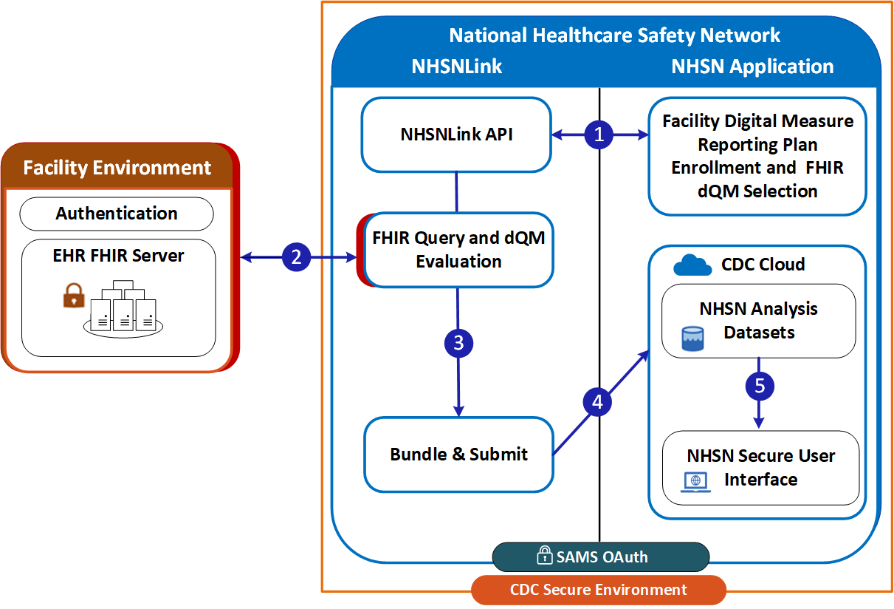

This section of the implementation guide (IG) defines the specific conformance requirements for systems wishing to conform to this NHSN dQM Reporting IG. The bulk of it focuses on evaluating facility data against measure criteria and submitting those data to NHSN, though it also provides guidance on privacy, security, and other implementation requirements.

### Pre-reading

Before reading this formal specification, implementers should first familiarize themselves with the [Use Cases](use_cases.html) page that describes the measure and reporting use cases this IG covers.

### Conventions

This IG uses specific terminology to flag statements that have relevance for the evaluation of conformance with the guide:

* **SHALL** indicates requirements that must be met to be conformant with the specification.

* **SHOULD** indicates behaviors that are strongly recommended (and which may result in interoperability issues or sub-optimal behavior if not adhered to), but which do not, for this version of the specification, affect the determination of specification conformance.

* **MAY** describes optional behaviors that are free to consider but are not a recommendation for or against adoption.

#### Must Support ###

The following rules regarding Must Support elements apply to all Profiles in this guide. The Must Support definitions are not inherited from other IGs, even for profiles in this guide that are derived from another guide.

##### Sender

* If the data element is available in the Fast Healthcare Interoperability Resources (FHIR) application programming interface (API) or electronic health record (EHR), the data element *SHALL* be provided (either through submission or response to a query) for measure calculation or risk adjustment.
* If the sender does not capture/store the data, the data are not available, or sharing of the data is not authorized, the system **SHOULD NOT** send the element if the element is not marked as mandatory (lower cardinality of 0).

##### Receiver

* The receiver **SHALL** be capable of processing resource instances containing must-support data elements without generating an error or causing the application to fail.
* The receiver **SHALL** be able to process resource instances containing must-support data elements asserting missing information (data absent reason extension).

<b>Note:</b> The profiles in this IG inherit from the [US Core]({{site.data.fhir.ver.uscore}}), which has some requirements that are more stringent than what is necessary for measure reporting (e.g. Practitioner references). This means that some inherited US Core required elements may not be used by NHSN and, if missing, may still pass NHSN ingestion validation.

#### Profiles

This specification makes significant use of [FHIR profiles]({{site.data.fhir.path}}profiling.html) to define the data requirements for measure-specific submissions.

The complete set of profiles defined in this IG can be found by following the links on the [Artifacts](artifact-listing.html) page.

#### Reporting Scenarios

The following reporting scenarios use the Actors defined in the [Actors and Use Cases](use_cases.html) page.

The general reporting workflows are detailed in the [Reporting Scenarios](https://hl7.org/fhir/us/nhsn-dqm/specification.html#reporting-scenarios) section of the [HL7 NHSN dQM Reporting Implementation Guide](https://hl7.org/fhir/us/nhsn-dqm/index.html).

#### NHSNLink Pull from NHSN

When NHSNLink pulls data from EHRs, both NHSNLink and the NHSN application reside within an NHSN-controlled environment. NHSNLink first retrieves the latest FHIR measures and related resources from the measure source and extracts the data requirements for each measure. NHSNLink queries the data source for data; evaluates the data against a measure; prepares bundles containing MeasureReport and supporting resources; and then performs pre-qualification. Additionally, it conducts measure-specific FHIR validation checks, before making the data available to NHSN back-end systems. In this scenario, the data source SHALL have a FHIR API that, at a minimum, provides read access to all resources required by the measure(s). 

<figure class="figure">
    <figcaption class="figure-caption"><strong>Figure 1: How NHSNLink Works</strong></figcaption>
    
</figure>

    API = application programming interface; dQM = digital quality measure; FHIR = Fast Healthcare Interoperability Resources; SAMS = Secure Access Management Services.

  Figure 1 (above) illustrates the process of how healthcare facility data flows securely into NHSN through NHSNLink. This process includes:
  <ol>
    <li>Enrollment and readiness: In the NHSN Application, the facility enrolls in the digital measure reporting plan. The facility selects FHIR dQMs, which are then communicated to the NHSNLink API engine. This step confirms the facility’s readiness to report digital quality measures and that it has signed the NHSN data-use agreements required for secure data sharing.</li>
    <li>Authentication and patient list: The facility’s EHR FHIR server is secured by an authentication mechanism. From this server, a Patients of Interest List is extracted and provided to NHSNLink. NHSNLink uses this list to query the facility’s EHR server for the data defined by the dQMs the facility is enrolled in.</li>
    <li>Evaluation and pre-qualification: NHSNLink evaluates and filters the data as defined by each dQM, bundles the data into a MeasureReport, and applies a pre-qualification process on the data.</li>
    <li>Submission: NHSNLink submits the MeasureReport bundles for patients meeting the dQM definitions to the NHSN Application through the CDC Cloud.</li>
    <li>Ingestion and reporting: The NHSN Application ingests and analyzes the MeasureReport bundles and makes reports available to facilities via secure NHSN user interface.</li>
  </ol>

