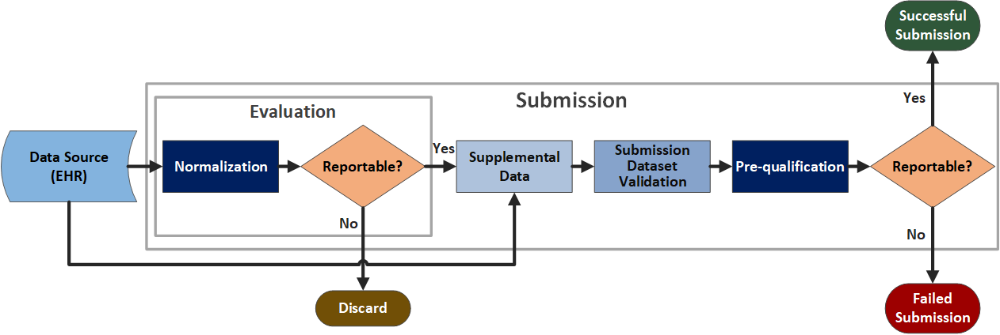

All submission data must pass pre-qualification prior to submission to the National Healthcare Safety Network (NHSN), regardless of the mechanism/tools used for evaluation and submission. Pre-qualification involves categorizing Fast Healthcare Interoperability Resources (FHIR) validation issues (errors, warnings and informational) for a given submission dataset to NHSN. Categories are defined to match one or multiple types of validation issues. One key component of every category is the required “acceptability” flag (field). Every category must be defined according to NHSN as either acceptable or unacceptable.  

### Example of an <i>Acceptable</i> validation issue
**Code does not match the preferred ValueSet**

The informational validation message, “none of the codings are in the value set, and a coding is recommended to come from this value set,” results when any coding outside of any value set with a preferred binding strength is found in any resource. For instance, the Acute Care Hospital (ACH) Monthly Event Encounter profile binds Encounter.hospitalization.dischargeDisposition to the [DischargeDisposition](http://hl7.org/fhir/R4/valueset-encounter-discharge-disposition.html) ValueSet with a [preferred](http://hl7.org/fhir/R4/terminologies.html#preferred) binding strength. In cases where a code that is not in this value set is found, FHIR validation will produce an informational message, “none of the codings are in the value set DischargeDisposition, and a coding is recommended to come from this value set.” Similarly, an instance of ACH Monthly Condition with Condition.severity containing a code representing “low,” FHIR validation will produce the message, “none of the codings are in the value set DiagnosisSeverity, and a coding is recommended to come from this value set.”  

NHSN has determined that all codes outside of value sets bound with a preferred binding strength are acceptable for submission. Therefore, both instances/messages would be categorized under “none of the codings are in the value set, and a coding is recommended to come from this value set” with an acceptable=true flag and would not result in the hindrance of submitting this scenario’s data set to NHSN.  

### Example of an <i>Unacceptable</i> validation issue
**Minimum requirement not met for profile**

The validation error message, “minimum required = 1, but only found 0 (from ‘profile’)”, results when any required element is missing from any resource. For instance, the [Acute Care Hospital (ACH) Monthly Encounter](StructureDefinition-ach-monthly-encounter.html) profile requires .period to follow every .location, e.g., Encounter.location.period. When .period is absent, the validation message "minimum required = 1, but only found 0” results. Similarly, [ACH Monthly Coverage](StructureDefinition-ach-monthly-coverage.html) requires .type, e.g.,  Coverage.class.type. When .type is missing, the validation message "minimum required = 1, but only found 0” results. 

NHSN has determined that resources missing required elements, as in the Encounter.location.period and Coverage.class.type examples, are unacceptable issues and therefore would result in a failed submission of this dataset to NHSN.  

<b>Note:</b> If one or more unacceptable categories exist within a potential data submission set, the entire dataset will not be submitted.  

### When Pre-qualification Happens During Submission to NHSN

Validation and subsequent pre-qualification occur after data evaluation and before final submission to NHSN. Implementers acting as data submitters to NHSN perform and attest to pre-qualification for each dataset submitted to NHSN. An implementer system representing a new data source targeting NHSN submission in conformance with this guide should expect extensive and iterative pre-qualification-driven testing to identify acceptable and unacceptable data quality issues. To ensure a successful NHSN submission, it is crucial to address the unacceptable issues with the guidance provided for resolution. These issues may be addressed and resolved through various potential mechanisms, such as technical (i.e., configuration) updates at the data source (EHR), modifications to clinical workflows, data querying, and/or data normalization.  

<figure class="figure">
    <figcaption class="figure-caption"><strong>Figure 1: Process Flow for Pre-qualification </strong></figcaption>
    
</figure>

  Figure 1 (above) represents the process flow for pre-qualification. This process includes:
  <ol>
    <li>Data retrieval: Primary dQM data is retrieved from the EHR Data Source through a secure FHIR API. This uses the Patients of Interest List and the dQM definitions in which the facility is enrolled.</li>
    <li>Initial evaluation: The data goes through an initial evaluation, which includes normalization and determination of what data is reportable.</li>
    <li>Filtering: Data determined to be reportable continues through the process. Data that is not reportable is discarded and does not move forward.</li>
    <li>Augmentation: Reportable data is augmented with related supplemental data retrieved from the same EHR Data Source API.</li>
    <li>Validation and bundling: The submission dataset is validated and packaged into a MeasureReport bundle.</li>
    <li>Pre-qualification: The dataset undergoes pre-qualification, which identifies potential issues (errors, warnings, informational). Each issue is categorized.</li>
    <li>Acceptability check: A key component of each category is acceptability, used to determine whether an issue is acceptable for submission to the NHSN Application.</li>
    <li>Submission outcome:
      <ul>
        <li>If no issues exist, or only “acceptable” issues are found, the submission is successful and sent to the NHSN Application.</li>
        <li>If one or more unacceptable issues exist, the dataset is not sent forward. Instead, it undergoes a review and remediation process</li>
      </ul>
    </li>
  </ol>

Pre-qualification categorization is technology agnostic; the frameworks and programming languages used to implement above do not matter. This allows the evaluation and submission of data to NHSN through multiple systems and pathways, provided pre-qualification results are acceptable. Similarly, the technology used to implement pre-qualification categorization to determine and assert only acceptable issues exist within a given submission dataset is not mandated.  

